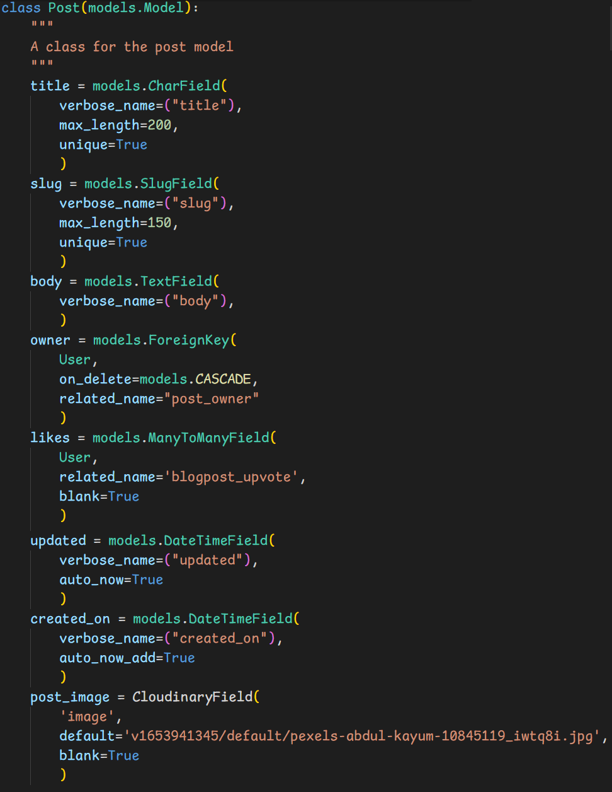
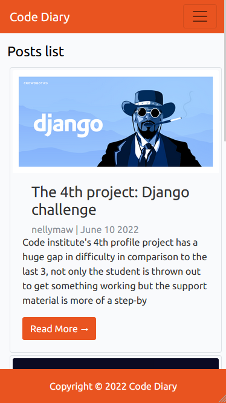
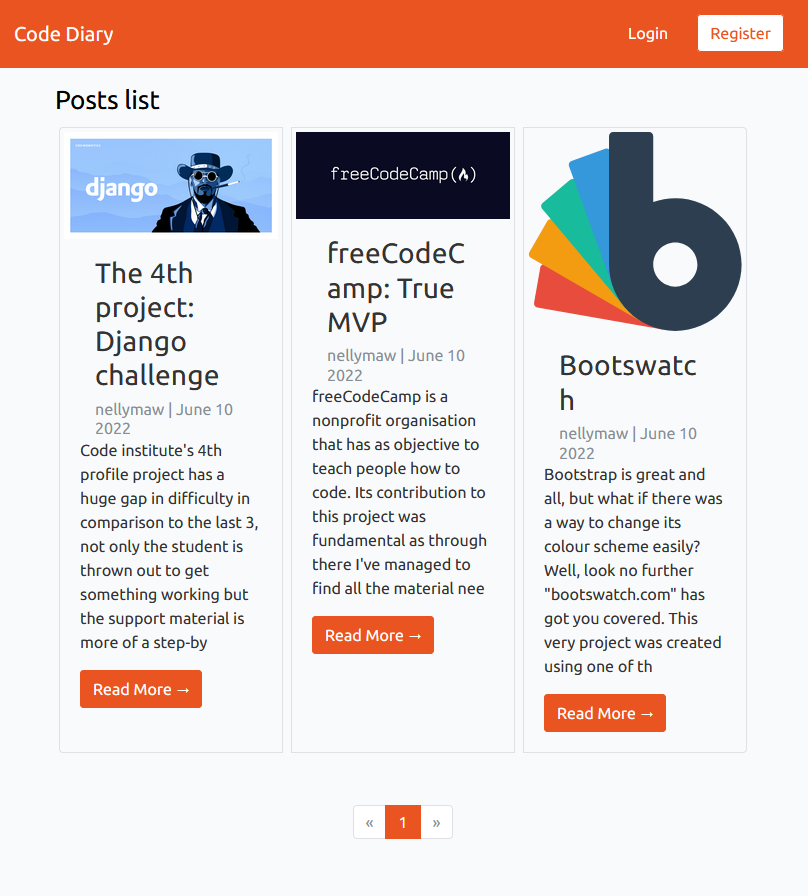
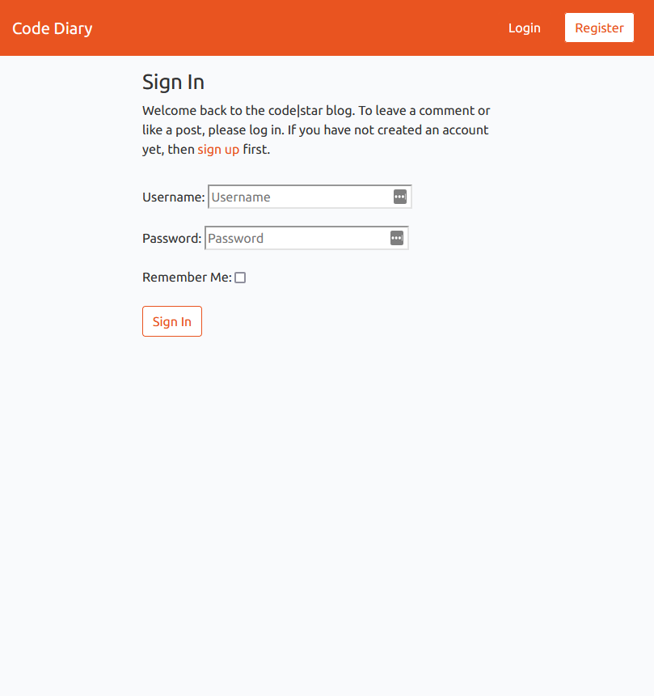
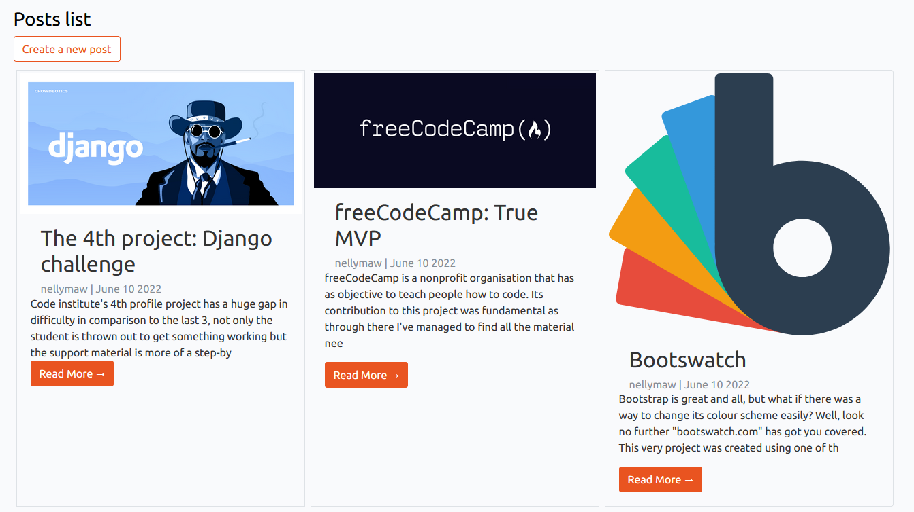
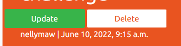

# Code Diary

**View the live site [here](https://code-diary-blog.herokuapp.com/)**

<details>
<summary>Click here to view phone viewport</summary>


</details>

<details>
<summary>Click here to view tablet viewport</summary>


</details>

<details>
<summary>Click here to view laptop viewport</summary>


</details>

<details>
<summary>Click here to view desktop viewport</summary>


</details>

___

- [Code Diary](#code-diary)
  - [1. User Experience (UX)](#1-user-experience-ux)
    - [Project goals](#project-goals)
    - [Strategy](#strategy)
      - [User stories](#user-stories)
    - [Scope](#scope)
      - [Strategy Trade-offs](#strategy-trade-offs)
      - [Code Structure](#code-structure)
        - [codeDiary(main project)](#codediarymain-project)
        - [blog app (this app contains all the functionality)](#blog-app-this-app-contains-all-the-functionality)
        - [Folders](#folders)
        - [Files](#files)
      - [Database](#database)
        - [Data Schema](#data-schema)
      - [Models](#models)
        - [User Model](#user-model)
        - [Profile Model](#profile-model)
        - [Post Model](#post-model)
        - [Comment Model](#comment-model)
      - [Definitions](#definitions)
      - [Wireframes](#wireframes)
      - [Surface](#surface)
      - [Color Palette](#color-palette)
      - [Typography](#typography)
  - [Features](#features)
    - [Existing features](#existing-features)
      - [Feature 1 - Navigation bar](#feature-1---navigation-bar)
      - [Feature 2 - Footer](#feature-2---footer)
      - [Feature 3 - Home page](#feature-3---home-page)
      - [Feature 4 Account Management](#feature-4-account-management)
        - [Sign in](#sign-in)
        - [Sign out](#sign-out)
        - [Sign up](#sign-up)
      - [Feature 5 Posts](#feature-5-posts)
      - [Feature 8 – Comments](#feature-8--comments)
        - [Features remaining to implement (long term objectives)](#features-remaining-to-implement-long-term-objectives)
  - [3. Testing](#3-testing)
    - [i. User stories testing](#i-user-stories-testing)
    - [ii. Validation testing](#ii-validation-testing)
      - [HTML](#html)
      - [CSS](#css)
      - [Python](#python)
      - [JavaScript](#javascript)
    - [iv. Unfixed Bugs](#iv-unfixed-bugs)
  - [4. Deployment](#4-deployment)
    - [Forking the GitHub Repository](#forking-the-github-repository)
    - [Making a Local Clone](#making-a-local-clone)
    - [Gitpod](#gitpod)
  - [5. Technologies Used](#5-technologies-used)
    - [Languages](#languages)
    - [Other Technologies](#other-technologies)
  - [6. Credits](#6-credits)
  - [7. Acknowledgements](#7-acknowledgements)

## 1. User Experience (UX)

### Project goals

To create a space where people can read/write about their daily struggles regarding coding.
As this project was by far the most challenging and got me seriously having to go through a few imposter syndromes, I've decided, when I was creating a mock project(which eventually would lay down the basic idea for this project), that a space where venting, in a small circle however in a anonymous manner.

___

### Strategy

#### User stories

1. As a **site user** I can **login with my username and password** so that **I can access the sites full functionality**

2. As a **logged-in site user** I can **log out of my account** so that **other users cannot access my account**

3. As a **site user** I can **see the current logged-in state** so that I know if I can access logged in functionality

4. As a **site user** I can **register** so that **I may login and access the full functionality of commenting and liking posts**

5. As a **site user**, i can **receive feedback if an URL is invalid, so that I receive a graceful UX and be correctly notified**

6. As a **guest/logged-in user** I can **view the latest 3 posts** so that **I can keep up to date with the latest posts**

7. As a **guest user**, I can **view posts** so that **I can keep up to date with the latest posts and user comments**

8. As a **Site User** I can **view a paginated list of posts** so that my **screen doesn't get overpopulated with posts**

9. As a **guest/logged-in user** I can **click on a post** so that **I can read the full article and related comments**

10. As a **logged-in site user** I can **like a post** so that **I make other readers and the writer of the post aware that I believe that post is worthwhile**

11. As a **logged-in user** I can **create a new post** so that **I can post content on the site for other users to view**

12. As a **logged in site user** I can **edit a post (subject header /text body)** so that I can change the content if required

13. As a **logged-in site user** I can **leave comments on a post** so that **I can take an active role in the forum (be involved in the conversation/express my opinion)**

14. As a **Site User** I can **delete a post that I have posted** so that **I can take content off the website**

[Table of Contents](#home)
___

### Scope

#### Strategy Trade-offs

I have rated the features on a scale of 1 to 5 in terms of importance (how important is it for the project now) and viability (how realistic is a solution implementation)

To achieve the strategy goals, the following features highlighted in green are implemented to create a minimal viable product due to the timescale and technical ability. The additional features in red will be added at a further stage.

<details>
<summary>Click here to view strategy trade offs</summary>


</details>

___

#### Code Structure

The code is spilt using the Django framework into the following apps, folders and files

##### codeDiary(main project)

- Settings.py - Settings
- Urls.py - Website urls

##### blog app (this app contains all the functionality)

- Admin.py  - used to display and customize the models in the Django admin panel
- Forms.py - used to customizing fields for the form to access
- Models.py - details all the model and every attribute
- Signals.py - signals allow certain senders to notify a set of receivers that some action has taken place
- Views.py - views are Python functions or classes that receive a web request and return a web response. All of the logic is held here.

##### Folders

- Static folder (CSS and Javascript files)
- Staticfiles (Django. contrib. staticfiles collects static files from each applications into a single location that can easily be served in production.)
- Templates folder:
  - all html files
  - allauth(django authentication)

##### Files

- manage.py: Main python file for starting the website
- custom_storage.py: AWS Boto3 configuration
- Procfile: To run the application
- Requirements.txt: Containing the python libraries installed
- Db.sqlite3 – Database for development
- README.md: Readme documentation

[Table of Contents](#home)

___

#### Database

A relational database was used for this project.
Heroku Postgres was used from early production until deployment.

##### Data Schema


___

#### Models

The following models were created to represent the database model structure for the website

##### User Model

- One to many relationship
- A user can have many posts
- The User model contains information about the user. It is part of the Django allauth library
- The model contains the following fields: username, password, first_name, last_name, email, is_staff, is_active, is_superuser, last_login, date_joined

##### Profile Model

- one to one relationship
- A user can have only one profile
- The user model contains a profile picture, either a default one if the user haven't provided one or a custom one otherwise.

<details>
<summary>Click here to view profile model</summary>


</details>

##### Post Model

- Relationships
  - A post can have many comments
  - A post can have many likes
  - A post can have one owner

- The post model contains fields about the post.
- This model captures the user to determine who made the post.  This is a foreign-key.
- likes is a many to many field to the user so we capture the user if they have pressed a thumbs up or not.
- Below are the fields and attribute for the Post model

<details>
<summary>Click here to view post model</summary>


</details>

##### Comment Model

- many to one relationship
- Many comments can have one post
- The comment model contains fields for the commenting functionality based on a post
- This model captures post. This is a foreign-key
- Below are the fields and attribute for the comment model

<details>
<summary>Click here to view comment model</summary>


</details>

#### Definitions

- models.ManytoManyField -A ManyToMany field - is used when a model needs to reference multiple instances of another model. E.g. A user can vote on many posts and votes can have many posts.

- Foreign key - Foreign Key is a ORM(Object-Relational Mapper) field-to-column mapping for creating and working with relationships between tables in relational databases.
e.g.on the Post model topic is the Foreign Key to the Topic model

- On_delete cascade – delete the rows from the child table automatically, when the rows from the parent table are deleted.  E.g. if you delete a post, all of the comments and votes are related to the post will be deleted

- Default – gives a default value

- Blank = True – allows the field to be blank, False means they cannot be blank

- Null – store empty values as NULL in the database. Default is False

- Max_length – max length of characters a user can enter

- Unique – the value needs to be unique in the database

- SlugField - A slug field is used to store and generate valid URLs for your dynamically created web pages. It will add”-“ where there are spaces in the url

- Related name - This is used when one record of a model A is related to exactly one record of another model B.  e.g. post field in the vote model is the same as the Foreignkey so we give it a related name “vote_post”

- Auto_now_add=True – gives the field the date when it was created

- Class meta - l Meta is basically the inner class of your model class. Model Meta is basically used to change the behavior of your model fields like changing order options,verbose_name and lot of other options

- Verbose name -  is a human-readable name for the field. If the verbose name isn't given, Django will automatically create it using the field's attribute name, converting underscores to spaces

- Ordering = ascending or descending

- \_\_str__(self)    return str(self.title) converts the object into a string for the admin page

- get_absolute_url(self return f”/post/{self.post.id}- converts the object in to a url string  “post/1” for example

[Table of Contents](#home)

___

#### Wireframes

I used Balsamiq to create wireframes for my project in order to plan out the layout of the interface, navigation and information design of the site on desktop, tablets and mobile devices.
Page | Wireframe |
------------ | -------------
Home page|[Mobile](readmeContent/wireframes/Phone/mainPage.png)/[Tablet](readmeContent/wireframes/Tablet/mainPage.png)/[Desktop](readmeContent/wireframes/Desktop/mainPage.png)
Home page while logged in|[Mobile](readmeContent/wireframes/Phone/loggedIn/mainPage.png)/[Tablet](readmeContent/wireframes/Tablet/loggedIn/mainPage.png)/[Desktop](readmeContent/wireframes/Desktop/loggedIn/mainPage.png)
Post details page|[Mobile](readmeContent/wireframes/Phone/postPage.png)/[Tablet](readmeContent/wireframes/Tablet/postPage.png)/[Desktop](readmeContent/wireframes/Desktop/postPage.png)
Post details page while logged in|[Mobile](readmeContent/wireframes/Phone/loggedIn/postPage.png)/[Tablet](readmeContent/wireframes/Tablet/loggedIn/postPage.png)/[Desktop](readmeContent/wireframes/Desktop/loggedIn/postPage.png)
SignUp page|[Mobile](readmeContent/wireframes/Phone/signUpPage.png)/[Tablet](readmeContent/wireframes/Tablet/signUpPage.png)/[Desktop](readmeContent/wireframes/Desktop/signUpPage.png)
Login page|[Mobile](readmeContent/wireframes/Phone/loginPage.png)/[Tablet](readmeContent/wireframes/Tablet/loginPage.png)/[Desktop](readmeContent/wireframes/Desktop/loginPage.png)
Profile page|[Mobile](readmeContent/wireframes/Phone/loggedIn/profilePage.png)/[Tablet](readmeContent/wireframes/Tablet/loggedIn/profilePage.png)/[Desktop](readmeContent/wireframes/Desktop/loggedIn/profilePage.png)
Logout page|[Mobile](readmeContent/wireframes/Phone/loggedIn/logoutPage.png)/[Tablet](readmeContent/wireframes/Tablet/loggedIn/logoutPage.png)/[Desktop](readmeContent/wireframes/Desktop/loggedIn/logoutPage.png)

___

#### Surface

My goal is to build a platform inclusive and accessible to everyone, so therefore it should be aesthetically pleasing in a generic style. [Bootswatch](https://bootswatch.com/) free theme , more specifically the [United](https://bootswatch.com/united/) theme, has been selected for the creation of this project.

#### Color Palette

The color palette was created by [Thomas Park](https://thomaspark.co/) and inspired by the [Ubuntu OS](https://ubuntu.com/) orange.

#### Typography

The following font Roboto have been selected to ensure the text is easy to read, add value to the text, and invoke user to perceive a positive emotion from the text. The fonts chosen are generic and therefore should appeal to any demographic/user. It is rated as Google's best font. I chose font Lato as a fallback

[Table of Contents](#home)

___

## Features

### Existing features

#### Feature 1 - Navigation bar

Navigation bar is featured on all pages at the top of the screen.

This section will allow the user to easily navigate back to the home page, edit his profile or logout.

Small screen devices

<details>
<summary>Click here to view image </summary>


</details>

**Left**

<details>
<summary>Click here to view image </summary>


</details>

- Brand Logo
- User can activate link to be taken to 'home'

**Right**

**Not Logged in user**
<details>
<summary>Click here to view image </summary>


</details>

- Hamburger style collapsable menu
- gives user two buttons one redirects user to the log in page the other redirects user to the signup page.

**Logged in user**
<details>
<summary>Click here to view image </summary>


</details>

- User profile picture
- Dropdown style collapsable menu
- gives user two buttons one redirects user to the profile edit page the other redirects user to the logout page.

**Medium and Large screen devices**
<details>
<summary>Click here to view image </summary>


</details>

**Left**

<details>
<summary>Click here to view image </summary>


</details>

- Brand Logo
- User can activate link to be taken to 'home'

**Right**

**Not Logged in user**
<details>
<summary>Click here to view image </summary>


</details>

- two buttons one redirects user to the log in page the other redirects user to the signup page.

**Logged in user**
<details>
<summary>Click here to view image </summary>


</details>

- User profile picture
- Dropdown style collapsable menu
- gives user two buttons one redirects user to the profile edit page the other redirects user to the logout page.

___

#### Feature 2 - Footer

The footer is displayed at the bottom of the page, since this is a niche focused website no social media links are deemed necessary.

**Responsive on all devices**

<details>
<summary>Click here to view image</summary>


</details>

___

#### Feature 3 - Home page

This section introduces the user to the Posts list containing the three most recent posts listed as quick reference, to support users in staying connected with newer posts. Pagination is provided so that older posts can still be accessed through the home page.

**Responsive on all devices**
<details>
<summary>Click here to view image - small devices</summary>


</details>
<br>

<details>
<summary>Click here to view image - medium and large devices </summary>


</details>
<br>

<details>
<summary>Click here to view image - flashing message </summary>


</details>
<br>

The homepage consists of

- Flash message section appears
- Page Title
- 3 latest posts
- Post title, posted by and created time fields displayed

___

#### Feature 4 Account Management

This section allows the user to independently register for an account, sign in/out and change their password so they can access the forum for more functionality

**Responsive on all devices**

##### Sign in

- As a registered user/admin can log into the site using their username or email address and password

<details>
<summary>Click here to view image - small devices</summary>


</details>

<details>
<summary>Click here to view image - medium and large devices </summary>


</details>

<br>

- If the user enters both fields correctly a success message ia displayed “successfully sign is as (username)”

<details>
<summary>Click here to view image  </summary>


</details>

<br>

- The "Login" and "Register" buttons are replaced with the user's profile picture and a dropdown menu with new buttons options: "Edit Profile" and "Logout"

<details>
<summary>Click here to view image  </summary>


</details>
<br>

___

##### Sign out

- As a signed in user, the user can sign out.

<details>
<summary>Click here to view image of sign out link</summary>


</details>
<details>
<summary>Click here to view image of sign out page</summary>


</details>

- A success message will appear “you have signed out”

<details>
<summary>Click here to view image of sign out page</summary>


</details>

- The user's profile picture and a dropdown menu are replaced with the "Login" and "Register" buttons

<details>
<summary>Click here to view image of sign out page</summary>


</details>

___

##### Sign up

- As a guest user, they can register for an account

<details>
<summary>Click here to view image of sign up page</summary>


</details>

- Once account is created successfully user is automatically logged in.

<details>
<summary>Click here to view image</summary>


</details>

- Admin users can create, edit and delete user profiles via the admin panel.

<details>
<summary>Click here to view images- Create user</summary>


</details>

- Upon User creation a Profile is automatically set for the user.

<details>
<summary>Click here to view images- Create user</summary>


</details>

<br>

<details>
<summary>Click here to view image - Delete user</summary>


</details>

___

#### Feature 5 Posts

The user will see value of signing up to be able to create/edit/delete posts in order to be an active user of the forum

**Responsive on all devices**

**Post list**

- All users can view the newest 3 posts

<details>
<summary>Click here to view image  </summary>


</details>

<br>

- **Logged in** users can add a new post through the "create a new post" button located just underneath the Posts List header

<details>
<summary>Click here to view image  </summary>


</details>

- A list of posts is displayed in descending order and paginated by 3
- Each Post card in the posts list consists of
  - Post Image - 1
  - Title - 2
  - who created the post - 3
  - when it was created - 4
  - Part of the post body - 5
  - a button that redirects the user to the post page - 6

<details>
<summary>Click here to view image</summary>


</details>

- A **logged in** user can start a new post 
  - Header title displayed “Add a new post”
  - User can enter post details
    - Title (required)
    - Body (required)
    - Upload an image
    - Select Submit post

<details>
<summary>Click here to view image  </summary>


</details>

- Success message “Post submitted”

<details>
<summary>Click here to view image  </summary>


</details>

**Post detail**

- A **not logged/logged in** in user can view a post in detail

  - Post contains

    - Title
    - Not logged in users - A link to sign in if the user would like to comment
    - Eho created the post
    - Time when the post was created
    - Update and delete post link is displayed if the user is the owner of the post else no links will be displayed
    - Post image will displayed. If user have not uploaded one, a placeholder is set to automatically be put in place.
    - Users comments will be displayed in descending order.

<details>
<summary>Click here to view image of a post - not logged in</summary>


</details>
<details>
<summary>Click here to view image of a post - logged in</summary>


</details>

- If a user encounters an error, the relevant error page is displayed (404)

<details>
<summary>Click here to view image</summary>


</details>

- An owner of the post can **“Update”** their post
  - **“Update”** button is displayed in the header
  - The fields are displayed with the post details.
  - User can edit the fields.
  - Success message displayed “post updated”.

<details>
<summary>Click here to view image - update post</summary>


</details>
<details>
<summary>Click here to view image - updated post - success message</summary>


</details>

- An owner of the post can **“Delete”** their post
  - Delete post is displayed in the header
  - Post title is displayed and a question to whether the   user is sure to delete the post
  - User can click Cancel to go back to the post Or Delete  post to delete the post from the database
  - If they click "delete" post , a success message   displayed “Post deleted”

<details>
<summary>Click here to view image of delete post page</summary>


</details>

<details>
<summary>Click here to view image of delete post page - success message
</summary>


</details>

___

#### Feature 8 – Comments

The user will see value of signing up to be able to add new comment on a post and potentially interact with other users

**Responsive on all devices**

<details>
<summary>Click here to view image of comment section (logged in)</summary>


</details>
<br>

**Not signed in users**

- If no comments are made
  - "Be the first one to comment!" displayed
  - "Sign In to comment" displayed
  
<details>
<summary>Click here to view image </summary>


</details>
<br>

- If any comment is made
  - The comment is displayed but NO further interaction with it is possible

<details>
<summary>Click here to view image </summary>


</details>
<br>

**Signed in users**

- New comment form is visible
- If no comments are made
  - "Be the first one to comment!" displayed

<details>
<summary>Click here to view image </summary>


</details>

- If any comment is made
  - The comment is displayed but NO further interaction with it is possible

<details>
<summary>Click here to view image </summary>


</details>

- User can enter their comment in the field and click Submit

<details>
<summary>Click here to view image </summary>


</details>

- Redirected to the post, comment will be at the bottom of the list

<details>
<summary>Click here to view image </summary>


</details>

- Admin users can edit and delete comments via the admin panel

<details>
<summary>Click here to view image - Create comment </summary>


</details>

<details>
<summary>Click here to view image - Edit comment </summary>


</details>
<details>
<summary>Click here to view image - Delete comment </summary>


</details>

___

##### Features remaining to implement (long term objectives)

- Edit / delete comments
- Direct message
- Account profile with bio amd user history of posts
- Reply to comments

[Table of Contents](#home)

___


## 3. Testing

### i. User stories testing

1. As a **site user** I can **login with my username and password** so that **I can access the sites full functionality**

<details>
<summary>
Click here to see the user story validation
</summary>

Click on the login button located on the top right of the screen **(users of smaller screen it is found in the hamburger style menu)**


Proceed to populate the fields with the required information (username and password), then hit sign in located at the bottom of the login form


</details>

2. As a **logged-in site user** I can **log out of my account** so that **other users cannot access my account**

<details>
<summary>
Click here to see the user story validation
</summary>

Click on the user button located on the top right of the screen and press logout button to be redirected to the logout page.


Confirm intent to log out by pressing the logout button
found at the bottom of the logout form.

</details>

3. As a **site user** I can **see the current logged-in state** so that I know if I can access logged in functionality

<details>
<summary>
Click here to see the user story validation
</summary>

At first moment after logging in the user will be redirected to the main page and a message explecitly indicating that he logged in will be displayed.


While logged in the user will proceed to see his/her profile picture at the end of the navbar followed by a dropdown menu containing the options to edit his profile or logout

<br>
**If user is not logged in a "login" and a "register" button will be displayed instead*

</details>

4. As a **site user** I can **register** so that **I may login and access the full functionality of commenting and liking posts**

<details>
<summary>
Click here to see the user story validation
</summary>

Press the **register button** to be redirected to the registration page


Fill in the required fields (email is optional) and press **Sign up** button.


**If all the information was correctly submited the new user will be logged in automatically.*

</details>

5. As a **site user**, i can **receive feedback if an URL is invalid, so that I receive a graceful UX and be correctly notified**

<details>
<summary>
Click here to see the user story validation
</summary>

In case a URL is invalid a custom page will be displayed and the user will have the opportunity to go back to the main page through a button


</details>

6. As a **guest/logged-in user** I can **view the latest 3 posts** so that **I can keep up to date with the latest posts**

<details>
<summary>
Click here to see the user story validation
</summary>

Main page will display the 3 latest posts to any user accessing the website.


</details>

7. As a **guest user**, I can **view posts** so that **I can keep up to date with the latest posts and user comments**

<details>
<summary>
Click here to see the user story validation
</summary>

Upon clicking the **Read More** button displayed on the main page user will be redirected to the post page.


</details>

8. As a **Site User** I can **view a paginated list of posts** so that my **screen doesn't get overpopulated with posts**

<details>
<summary>
Click here to see the user story validation
</summary>

Pagination can be found at the bottom of the main page. Main page displays 3 posts per page.


</details>

9. As a **guest/logged-in user** I can **click on a post** so that **I can read the full article and related comments**

<details>
<summary>
Click here to see the user story validation
</summary>

**Read more** button,found at the bottom of each post in main page post list, redirects user to the post page.


All users can see the post image, post title, ammount of likes and comments, post body and the comments.<br>
**Only logged in users can comment*


</details>

10. As a **logged-in site user** I can **like a post** so that **I make other readers and the writer of the post aware that I believe that post is worthwhile**

<details>
<summary>
Click here to see the user story validation
</summary>

Logged in users can click on the "like" button(heart shaped), located underneath the post header.


Once clicked the icon will change to a filled heart (the amount of likes will also automatically be updated to the latest number when the page was loaded.)


The user can click the button again in case he changed his mind or if the button was pressed by mistake. returning it back to the original icon.


</details>

11. As a **logged-in user** I can **create a new post** so that **I can post content on the site for other users to view**

<details>
<summary>
Click here to see the user story validation
</summary>

While logged in and in the main page a **Create a new post** button will be visible. Once it's clicked the user will be redirected to the post creation page.


In the creation page user is required to provide a title and a body for his post. An image is no required as there is a placeholder in case none is provided.


12. As a **logged in site user** I can **edit a post (subject header /text body)** so that I can change the content if required

<details>
<summary>
Click here to see the user story validation
</summary>

When inside one of the posts that was created by the user an **Update** button is visible underneath the post title. Clicking it will redirect user to the update post form.



Inside the update post form user is able to change the title, body and image of the same post. Once user is finished with alterations just hit **Submit post** button and the changes will be applied

</details>

13. As a **logged-in site user** I can **leave comments on a post** so that **I can take an active role in the forum (be involved in the conversation/express my opinion)**

<details>
<summary>
Click here to see the user story validation
</summary>

Logged in users have access to the comment form which displays the user name and a empty text field, once **submit** button is pressed and form is succesfully processed the user comment will be displayed in the comment section.


</details>

14. As a **Site User** I can **delete a post that I have posted** so that **I can take content off the website**

<details>
<summary>
Click here to see the user story validation
</summary>

When inside one of the posts that was created by the user a **Delete** button is visible underneath the post title. Clicking it will redirect user to the delete post URL.


On the delete post URL the user will prompted with a choice to delete the post or to return.


</details>
___

### ii. Validation testing


#### HTML

<details><summary>
Click on the link to see the W3Validator validation testing</summary>


</details>

#### CSS

<details><summary>
Click on the link to see the Jigsaw validation testing</summary>


</details>

#### Python

[Click on the link to go to the Python code validation page](readmeContent/validation/python)

#### JavaScript

<details><summary>
Click on the link to see the Jshint validation testing</summary>


</details>

___

### iv. Unfixed Bugs

No known unfixed bugs
___

## 4. Deployment

### Forking the GitHub Repository

By forking the GitHub Repository we make a copy of the original repository on our GitHub account to view and/or make changes without affecting the original repository by using the following steps...

1. Log in to GitHub and locate the [GitHub Repository](https://github.com/nellymaw/P4-codeInstitute)
2. At the top of the Repository (not top of page) just above the "Settings" Button on the menu, locate the "Fork" Button.
3. You should now have a copy of the original repository in your GitHub account.

### Making a Local Clone

1. Log in to GitHub and locate the [GitHub Repository](https://github.com/nellymaw/P4-codeInstitute)
2. Under the repository name, click "Clone or download".
3. To clone the repository using HTTPS, under "Clone with HTTPS", copy the link.
4. Open Git Bash
5. Change the current working directory to the location where you want the cloned directory to be made.
6. Type `git clone`, and then paste the URL you copied in Step 3.

```
$ git clone https://github.com/YOUR-USERNAME/YOUR-REPOSITORY
```

7. Press Enter. Your local clone will be created.

```
$ git clone https://github.com/YOUR-USERNAME/YOUR-REPOSITORY
> Cloning into `YOUR-REPOSITORY`...
> remote: Counting objects: 10, done.
> remote: Compressing objects: 100% (8/8), done.
> remove: Total 10 (delta 1), reused 10 (delta 1)
> Unpacking objects: 100% (10/10), done.
```

### Gitpod

1. Install the gitpod browser extension. [Gitpod Browser Extension](https://www.gitpod.io/docs/browser-extension/)
2. Go to the project repository. [Password Generator](https://github.com/nellymaw/P4-codeInstitute)
3. click the gitpod button beside the about section.  

___

## 5. Technologies Used

### Languages

[Django](https://www.djangoproject.com/)

- This project was created using the Django framework, the back-end logic and the means to run/view the Website.
- The Django unit test library was used for unit tests

[HTML](https://en.wikipedia.org/wiki/HTML)

- This project uses HTML as the main language used to complete the structure of the Website.

[CSS](https://en.wikipedia.org/wiki/CSS)

- This project uses custom written CSS to style the Website.
  
[JavaScript](https://www.javascript.com)

- JavaScript is used all scripting on the site

Python 3 - this projects core was created using Python, the back-end logic and the means to run/view the Website.
*Package used for virtual environment:*

- pipenv== 2022.5.2

*Python Modules used (These can be found in the requirements.txt project file):*

- asgiref==3.5.2; python_version >= '3.7'
- bleach==5.0.0; python_version >= '3.7'
- certifi==2022.5.18.1; python_version >= '3.6'
- cffi==1.15.0
- charset-normalizer==2.0.12; python_version >= '3'
- cloudinary==1.29.0
- cryptography==37.0.2
- defusedxml==0.7.1; python_version >= '2.7' and python_version not in '3.0, 3.1, 3.2, 3.3, 3.4'
- dj-database-url==0.5.0
- dj3-cloudinary-storage==0.0.6
- django-allauth==0.50.0
- django-crispy-forms==1.14.0
- django-summernote==0.8.20.0
- django==4.0.5
- gunicorn==20.1.0
- idna==3.3; python_version >= '3'
- oauthlib==3.2.0; python_version >= '3.6'
- pillow==9.1.1
- psycopg2==2.9.3
- pycparser==2.21
- pyjwt[crypto]==2.4.0; python_version >= '3.6'
- python3-openid==3.2.0
- requests-oauthlib==1.3.1; python_version >= '2.7' and python_version not in '3.0, 3.1, 3.2, 3.3'
- requests==2.27.1; python_version >= '2.7' and python_version not in '3.0, 3.1, 3.2, 3.3, 3.4, 3.5'
- setuptools==62.3.2; python_version >= '3.7'
- six==1.16.0; python_version >= '2.7' and python_version not in '3.0, 3.1, 3.2, 3.3'
- sqlparse==0.4.2; python_version >= '3.5'
- tzdata==2022.1; sys_platform == 'win32'
- urllib3==1.26.9; python_version >= '2.7' and python_version not in '3.0, 3.1, 3.2, 3.3, 3.4' and python_version < '4'
- webencodings==0.5.1

### Other Technologies

[BootsWatch](https://bootswatch.com/)

- Bootswatch was used through the website for layout and responsiveness. This framework is based on [Bootstrap](https://getbootstrap.com/readme/docs/4.0) and uses icons from [Font Awesome](https://fontawesome.com/) and fonts from [Google Fonts](https://fonts.google.com/)

[Visual Studio Code](https://code.visualstudio.com/)

- Visual Studio Code was used as the IDE for this project.

[Git](https://git-scm.com/)

- Git has been used for Version Control.

[GitHub](https://github.com/)

- GitHub has been used to create a repository to host the project and receive updated commits from GitPod.

[Heroku](https://id.heroku.com/login)

- Used to deploy the application.

[Cloudinary](https://cloudinary.com/)

- Cloudinary cloud is used as storage solution

[Postgres](https://www.postgresql.org/)

- The deployed project on Heroku uses a Postgres databaseHTML Markup Validation Service (https://validator.w3.org/)
- HTML validation service for validation the css in the project

[CSS Validation Service](https://jigsaw.w3.org/css-validator/)

- CSS validation service for validation the css in the project

[JSHint](https://jshint.com/)

- For javascript code quality

[PEP8 Online Validation Service](http://pep8online.com)

- The PEP8 Online Validation Service was used to validate the Python document for this project and to identify any issues with the code.Mozilla DevTools
- Firefox's built in developer tools are used to inspect page elements and help debug issues with the site layout and test different CSS styles.

[Balsamiq Wireframes](https://balsamiq.com/)

- This was used to create wireframes for 'The Skeleton Plane' stage of UX design.

[SQL DRAW](https://drawsql.app/)

- Database diagram editor

[Am I Responsive](http://ami.responsivedesign.is/)

- Multi Device Website Mockup Generator was used to create the Mock up image in this README

[Table of Contents](#home)
___

## 6. Credits

See below list of tutorials and documentation i used throughout this project

- The basic skelton setup for this project was based on  "I think therefore I blog project by the Code Institute"

- https://cloudinary.com/documentation/django_integration (which was ultimately scrapped along the project for a simplified method)
- https://www.youtube.com/watch?v=04L0BbAcCpQ (which was found at freeCodeCamp)
- https://www.youtube.com/watch?v=oU9kN13-Xbs (which was found at freeCodeCamp)
- https://www.youtube.com/watch?v=kqyfEz7TNI0 (which was found at freeCodeCamp)
- https://www.youtube.com/c/Codemycom - **Django Blog Series** (which was a massive help with some issues found along the way)

General troubleshoot

- https://stackoverflow.com/questions/41883254/django-is-not-a-registered-namespace
- https://stackoverflow.com/questions/36805137/how-to-pass-options-to-cloudinaryfield-in-django-model
- https://stackoverflow.com/questions/3644902/how-to-check-if-a-user-is-logged-in-how-to-properly-use-user-is-authenticated
- https://stackoverflow.com/questions/57200861/the-joined-path-is-located-outside-of-the-base-path-component
- https://stackoverflow.com/questions/42491691/how-do-i-add-custom-css-to-crispy-forms
- https://stackoverflow.com/questions/48034274/using-django-crispy-forms-how-do-you-shrink-the-text-box-for-a-textfield
- https://stackoverflow.com/questions/17314548/display-date-and-time-in-django

## 7. Acknowledgements

Massive thanks to the technology gurus out there, specially John Elder from codemy.com youtube channel who was an absolute legend through his youtube series, everyone involved with freeCodeCamp, all the staff at Code Institute.
Special thanks to Lukaz Makinia from who most of my understanding of this language came from.

And finally to my girlfriend who somehow manage to keep up with me through this (at some times) soul crushing endeavours.

[Table of Contents](#home)
