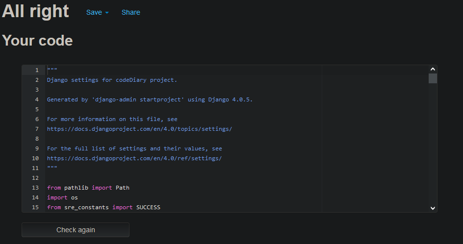
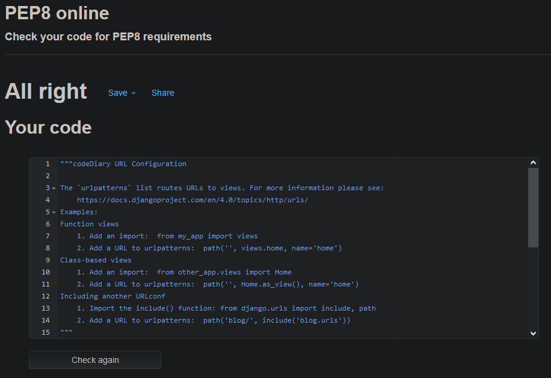
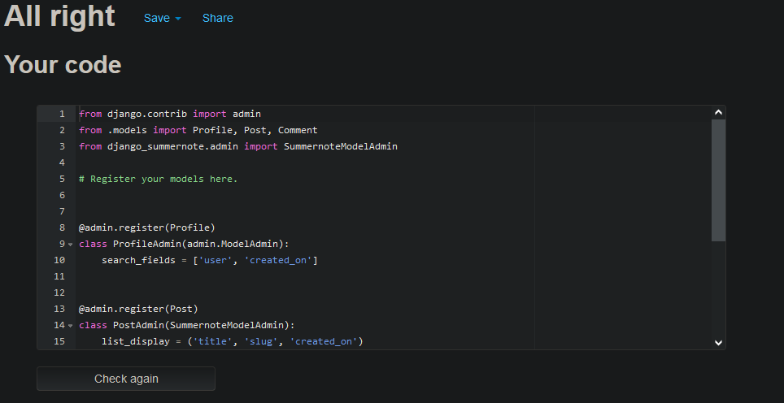
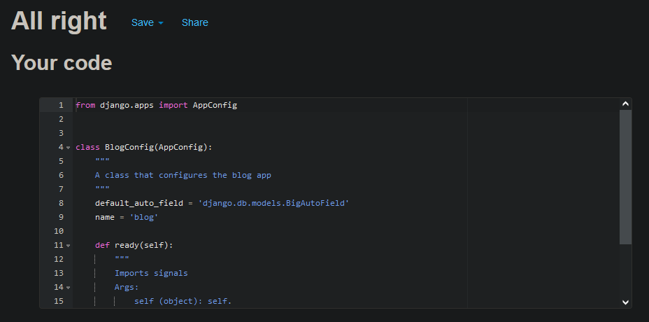
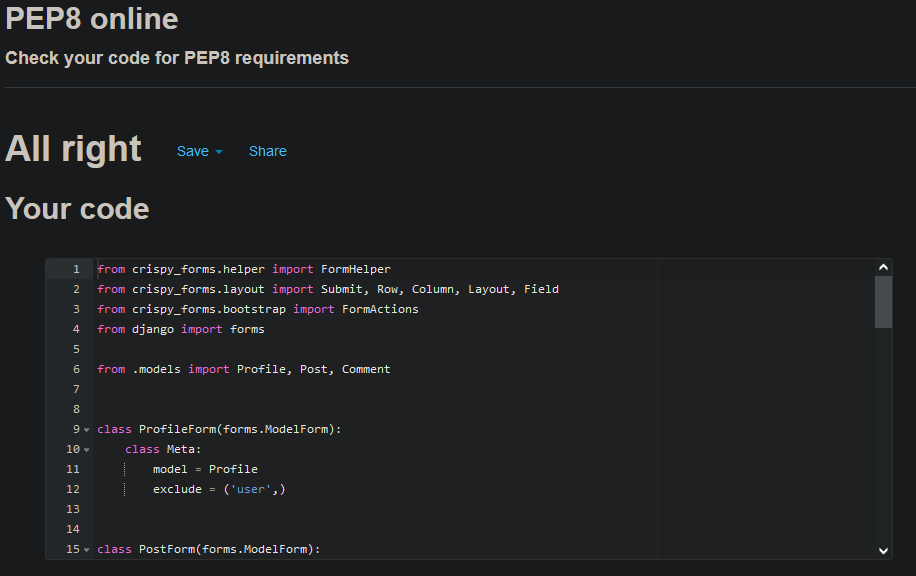
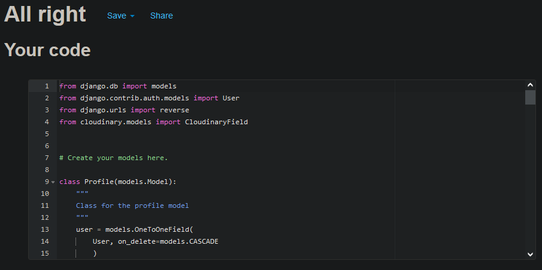
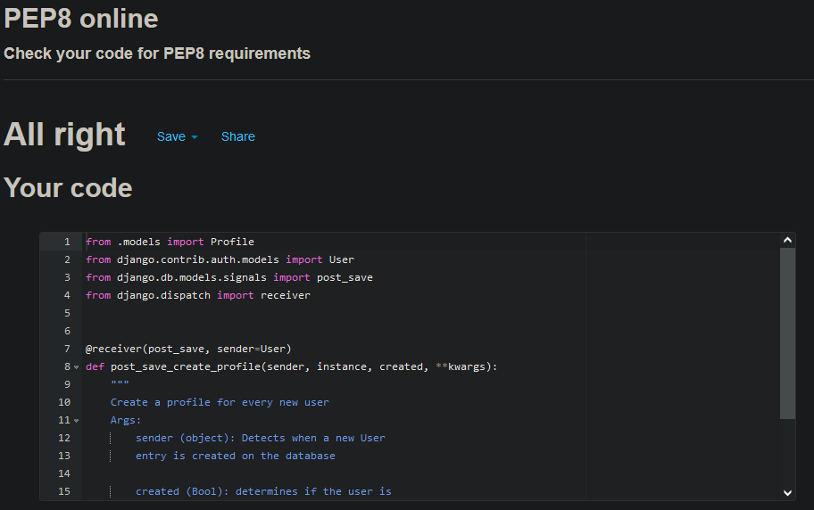
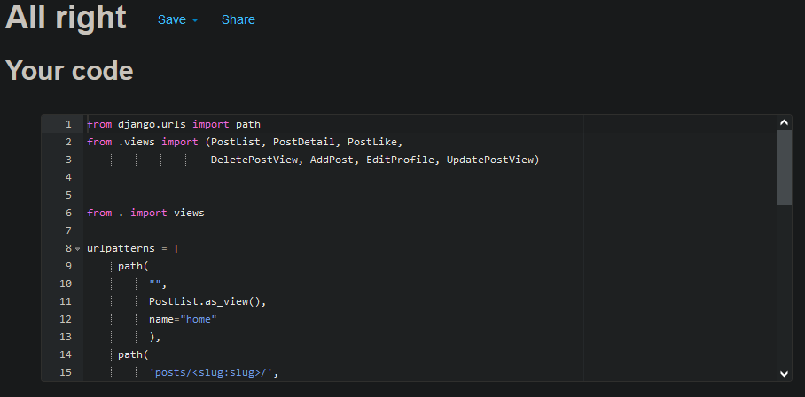

# Python Validation

This folders has been created and organized like the main project structure.

You will find the validation images separeated in their respective directories.

## codeDiary

settings.py

urls.py

## blog

admin.py

apps.py

forms.py

models.py

signals.py

urls.py

views.py

